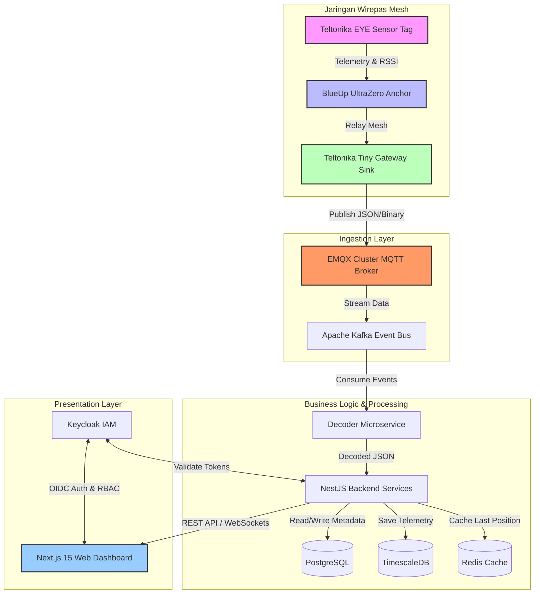
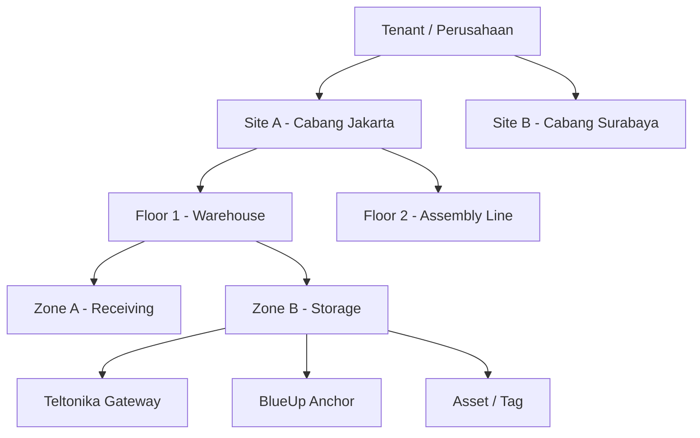
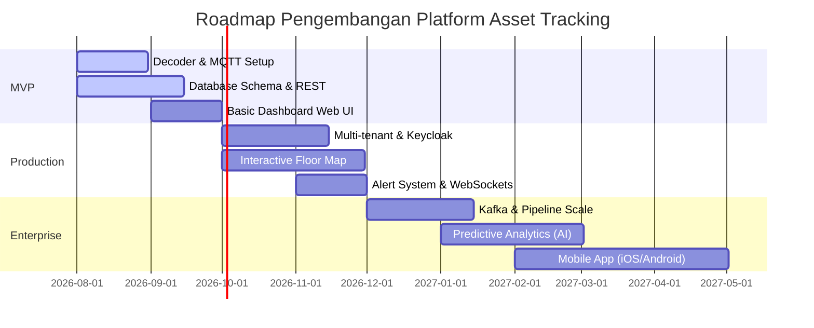

# 📡 Platform Asset Tracking Multi‑Tenant Industri (Wirepas Mesh + Teltonika)

[](https://nextjs.org/)
[](https://nestjs.com/)
[](https://www.postgresql.org/)
[](https://www.timescale.com/)
[](https://www.emqx.io/)
[](https://kafka.apache.org/)
[](https://redis.io/)
[](https://www.keycloak.org/)
[](https://www.docker.com/)
[](https://kubernetes.io/)

Platform *asset tracking* tingkat perusahaan (*enterprise*) yang dirancang untuk pelacakan aset industri secara *real-time*, aman, memiliki skalabilitas tinggi, mendukung multi-tenant, dan siap dipasarkan sebagai solusi SaaS.

---

## 🧭 Navigasi Cepat

- [1. Latar Belakang & Kasus Penggunaan](#1-latar-belakang--kasus-penggunaan)
- [2. Arsitektur Sistem](#2-arsitektur-sistem)
- [3. Struktur Proyek](#3-struktur-proyek)
- [4. Konsep Multi-Tenant](#4-konsep-multi-tenant)
- [5. Metode Positioning & Sensor](#5-metode-positioning--sensor)
- [6. Integrasi MQTT & Dekode Telemetri](#6-integrasi-mqtt--dekode-telemetri)
- [7. Konsep Dashboard & UI](#7-konsep-dashboard--ui)
- [8. Keamanan & Autentikasi](#8-keamanan--autentikasi)
- [9. Strategi Deployment & Skalabilitas](#9-strategi-deployment--skalabilitas)
- [10. Roadmap Pengembangan](#10-roadmap-pengembangan)

---

## 1. Latar Belakang & Kasus Penggunaan

Di lingkungan industri skala besar, memantau posisi dan kondisi fisik aset berharga secara presisi sangatlah krusial. Platform ini memanfaatkan kombinasi teknologi **Wirepas Mesh** (protokol mesh nirkabel dengan keandalan tinggi dan konsumsi daya rendah) dengan perangkat keras kelas industri dari **Teltonika** dan **BlueUp**.

### Perangkat Keras Utama
*   **Teltonika Tiny Gateway**: Bertindak sebagai *Sink* Wirepas untuk menjembatani komunikasi mesh ke jaringan IP (MQTT).
*   **BlueUp UltraZero**: Bertindak sebagai *Anchor / Router* dengan koordinat tetap untuk referensi kalkulasi posisi (RSSI).
*   **Teltonika EYE Sensor Mesh (MTSMP1)**: Bertindak sebagai *Tag / Sensor* yang dipasang pada aset bergerak untuk mengirimkan telemetri & data pergerakan.

### Target Industri
*   🏭 **Pabrik & Manufaktur**: Pelacakan material setengah jadi (WIP) dan mesin.
*   📦 **Gudang & Logistik**: Lokasi *forklift*, palet, kontainer, dan manajemen inventaris.
*   🏥 **Rumah Sakit (Healthcare)**: Pelacakan peralatan medis portabel (defibrilator, kursi roda) dan pemantauan suhu rantai dingin (*cold-chain*).
*   🚢 **Pelabuhan & Hub Transportasi**: Manajemen alat berat dan kontainer di area terbuka/tertutup.

---

## 2. Arsitektur Sistem

### Aliran Data (Data Flow)



### Penjelasan Komponen
1.  **Mesh Network**: EYE Sensor mengirimkan data telemetri yang diteruskan oleh *Anchor* menggunakan teknologi self-healing mesh dari Wirepas hingga mencapai *Gateway (Sink)*.
2.  **Ingestion Layer**: EMQX mengelola jutaan pesan MQTT secara paralel. Kafka bertindak sebagai *message broker buffer* untuk menjamin data tidak hilang sebelum didekode.
3.  **Service Layer**: Microservice berbasis NestJS mendekode payload biner/JSON, menyalin status sensor terkini ke Redis untuk akses instan (*real-time*), menyimpan riwayat telemetri di TimescaleDB (optimal untuk data deret waktu), serta menyimpan konfigurasi tenant/aset di PostgreSQL.
4.  **Application Layer**: Next.js 15 menghadirkan dashboard interaktif dengan peta denah lantai (*floor plan*), topologi mesh, dan analisis grafik menggunakan pustaka visualisasi modern.

---

## 3. Struktur Proyek

Platform ini menggunakan pendekatan monorepo untuk mempermudah pengembangan dan kolaborasi tim:

```
geomesh/
├── apps/
│   ├── backend/                  # NestJS Application API Services
│   │   ├── src/
│   │   │   ├── modules/          # Assets, Tenants, Zones, Alerting
│   │   │   └── decoders/         # Wirepas parser logic for endpoints 11/238
│   │   └── prisma/               # Database schemas & migrations
│   └── frontend/                 # Next.js 15 Dashboard Web App
│       ├── src/
│       │   ├── components/       # Reusable UI Components (Shadcn/ui)
│       │   ├── pages/            # Floorplan, Mesh Topology, Analytics
│       │   └── hooks/            # Custom React Query & WebSocket hooks
│       └── public/               # Static assets & Floorplan plans
├── deployment/
│   ├── docker/                   # Dockerfiles & docker-compose for local development
│   └── k8s/                      # Kubernetes Helm charts & YAML manifests (Prod)
├── packages/
│   └── shared-types/             # TypeScript interfaces shared between frontend & backend
└── README.md                     # File dokumentasi utama ini
```

---

## 4. Konsep Multi-Tenant

Platform ini menerapkan isolasi data multi-tenant tingkat tinggi. Struktur organisasi data didefinisikan secara hierarkis seperti diagram di bawah:



### Isolasi & Keamanan Data Tenant
*   **Filter Query**: Semua tabel transaksi dan telemetri memiliki relasi dengan `tenant_id`. Seluruh kueri SQL/Prisma wajib menyertakan filter `where: { tenantId }`.
*   **Keamanan API**: Gateway API memverifikasi klaim `tenant_id` yang terdapat pada JWT token Keycloak pada setiap permintaan REST maupun koneksi WebSocket.
*   **Pembagian Hak Akses**: Dukungan penuh terhadap *Role-Based Access Control* (RBAC) seperti `SuperAdmin`, `TenantAdmin`, `SiteManager`, dan `Operator`.

---

## 5. Metode Positioning & Sensor

Platform mendukung 3 metode penentuan posisi aset di dalam ruangan (*Indoor Positioning*):

### Perbandingan Metode Positioning

| Metode | Deskripsi | Akurasi | Kompleksitas | Kasus Penggunaan Utama |
|---|---|---|---|---|
| **Zone-Based (RSSI Terkuat)** | Menentukan lokasi tag berdasarkan koordinat Anchor terdekat yang menghasilkan nilai RSSI (dBm) tertinggi. | 2 – 10 meter | Sangat Rendah | Pelacakan umum zona ruangan, pelacakan inventaris rak gudang. |
| **Weighted Centroid** | Kalkulasi posisi ($x, y$) tag menggunakan rata-rata terbobot dari koordinat beberapa Anchor terdekat berdasarkan kekuatan RSSI. | 2 – 5 meter | Sedang | Pelacakan pergerakan forklift di lorong gudang. |
| **Fingerprinting** | Pemetaan pola RSSI pada tahap survei lokasi ke dalam basis data untuk mencocokkan pola sinyal waktu nyata. | 1 – 3 meter | Tinggi | Navigasi presisi dalam lingkungan industri yang padat logam. |

---

## 6. Integrasi MQTT & Dekode Telemetri

Data dari sensor dikirimkan melalui topik MQTT standar dengan format:
`wirepas/gateway/<gateway_id>/node/<node_id>/endpoint/<endpoint_id>`

### Struktur Payload Wirepas

#### 📡 Endpoint 11: Telemetri Sensor Fisik (Akselerometer, Suhu, Kelembapan)
Dikirim secara berkala atau dipicu oleh deteksi pergerakan (*motion trigger*).
```json
{
  "timestamp": 1722204323,
  "node_id": 439201,
  "endpoint": 11,
  "payload_json": {
    "temperature": 24.5,
    "humidity": 55.2,
    "accel_x": 0.05,
    "accel_y": -0.02,
    "accel_z": 0.98,
    "pitch": 2.5,
    "roll": -1.2,
    "hall_sensor": 0
  }
}
```

#### 🔋 Endpoint 238: Status & Kesehatan Node
Berisi informasi performa baterai dan parameter mesh.
```json
{
  "timestamp": 1722204323,
  "node_id": 439201,
  "endpoint": 238,
  "payload_json": {
    "battery_voltage": 3.6,
    "rssi": -65,
    "motion": true,
    "hop_count": 2,
    "update_interval": 30
  }
}
```

### Logika Deteksi Status Aset
Menggunakan akselerometer 3-axis serta data Pitch & Roll untuk menyimpulkan kondisi aset secara dinamis:

| Status Aset | Kondisi Trigger Sensor | Contoh Kasus |
|---|---|---|
| **Static** | Tidak ada pergerakan, nilai akselerometer stabil mendekati gravitasi ($1\text{G}$ pada sumbu Z). | Palet/barang disimpan di rak. |
| **Moving** | Akselerometer mendeteksi perubahan nilai secara berulang ($> 0.1\text{G}$). | Forklift sedang berjalan membawa barang. |
| **Tilt Warning** | Sudut Pitch atau Roll melebihi batas toleransi ($> 15^\circ$). | Palet diletakkan dalam posisi miring atau tidak stabil. |
| **Fall Detected** | Akselerometer mendeteksi akselerasi kejut mendadak ($> 2.5\text{G}$) disusul perubahan sudut signifikan. | Barang terjatuh dari rak penyimpanan atau forklift terbalik. |
| **High Vibration**| Getaran mikro terdeteksi konstan pada sumbu X & Y secara berkelanjutan. | Mesin produksi sedang menyala. |

---

## 7. Konsep Dashboard & UI

Dashboard dirancang menggunakan kerangka Next.js 15 dengan pustaka UI premium (Tailwind CSS + Shadcn/ui) untuk menyajikan visualisasi data yang responsif dan interaktif:

```
+-------------------------------------------------------------------------------+
| [Logo] Geomesh      [Tenant: PT ABC Logistics]           [User: Admin]        |
+-------------------------------------------------------------------------------+
|  Overview  |  Floor Plan  |  Mesh Topology  |  Alerts  |  Analytics  | Config |
+-------------------------------------------------------------------------------+
|  +-----------------------+ +--------------------+ +-------------------------+ |
|  | TOTAL ASSETS: 1,240   | | ONLINE TAGS: 1,210 | | ACTIVE ALERTS: 3        | |
|  +-----------------------+ +--------------------+ +-------------------------+ |
|                                                                               |
|  [ Floor Map Visualizer (React Konva / Canvas) ]                              |
|  +-------------------------------------------------------------------------+  |
|  | [Zone A: Receiving]                                 [Zone B: Storage]   |  |
|  |     o [Asset #10] (Moving)                                              |  |
|  |                                                         o [Asset #24]   |  |
|  |              * [Anchor 1]                                               |  |
|  |                                                                         |  |
|  |                                            * [Anchor 2] (Low Bat!)      |  |
|  +-------------------------------------------------------------------------+  |
|                                                                               |
|  ⚡ Live Notifications (WebSockets):                                          |
|  - [10:04:12] ALERT: Asset #24 (Tilt Warning) detected at Storage Zone        |
|  - [10:02:45] SYSTEM: Gateway #2 status is ONLINE                             |
+-------------------------------------------------------------------------------+
```

*   **Peta Interaktif (Floor Plan)**: Memanfaatkan `React Konva` untuk menggambar denah ruangan dalam format 2D SVG/PNG, mendukung fitur *drag-and-drop* penempatan Anchor, dan menampilkan posisi ikon tag sensor secara real-time.
*   **Visualisasi Topologi Mesh**: Menggunakan `React Flow` untuk menggambarkan struktur hop jaringan Wirepas dari Gateway -> Anchor -> Sensor Tag demi menyederhanakan pemantauan kesehatan jaringan mesh.

---

## 8. Keamanan & Autentikasi

*   **Keycloak IAM**: Mendukung Single Sign-On (SSO), manajemen pengguna tingkat enterprise, integrasi Active Directory / LDAP, dan autentikasi dua faktor (2FA).
*   **Enkripsi MQTT**: Koneksi dari *Tiny Gateway* ke *EMQX Broker* diamankan menggunakan protokol **MQTTS** (MQTT over TLS) dengan mekanisme otentikasi berbasis sertifikat klien (Mutual TLS / mTLS).
*   **Enkripsi Data**: Seluruh data yang disimpan pada PostgreSQL dan TimescaleDB terenkripsi pada saat istirahat (*Encryption at Rest*), dan koneksi internal antar layanan menggunakan TLS (*Encryption in Transit*).

---

## 9. Strategi Deployment & Skalabilitas

Platform ini didesain sejak awal agar siap dideploy ke kluster cloud (*Kubernetes Ready*):

*   **Penyimpanan Deret Waktu (TimescaleDB)**:
    *   Menggunakan fitur *Hypertables* untuk membagi data telemetri berdasarkan waktu secara otomatis guna menjaga performa baca-tulis tetap cepat.
    *   Kebijakan kompresi data (*Compression Policy*): Data telemetri mentah berumur lebih dari 30 hari akan dikompresi otomatis untuk menghemat ruang disk hingga 90%.
    *   Kebijakan retensi data (*Retention Policy*): Data mentah akan dihapus otomatis setelah 90 hari, sedangkan data agregat (rata-rata per jam) dipertahankan hingga 5 tahun untuk keperluan analitik.
*   **Skalabilitas Horizontal**:
    *   NestJS dideploy sebagai *stateless deployment* dalam Kubernetes Pods dengan fitur Horizontal Pod Autoscaler (HPA) berdasarkan metrik beban CPU/Memory.
    *   EMQX dideploy dalam format kluster *Core-Replicant* untuk menangani beban jutaan koneksi IoT secara dinamis.

---

## 10. Roadmap Pengembangan



---

*Dikembangkan oleh Tim IoT Geomesh. Untuk informasi lebih lanjut mengenai dokumentasi API dan lisensi, silakan hubungi tim pengembang atau buka bagian `apps/backend/docs`.*
