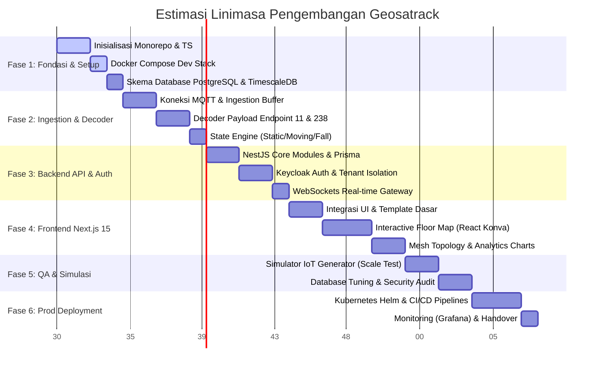

# 🗺️ Roadmap Pengembangan Platform Asset Tracking (Wirepas Mesh + Teltonika)

Dokumen ini berisi panduan terstruktur dari awal pembuatan lingkungan pengembangan (*setup*) hingga peluncuran versi produksi (*final production deployment*). Roadmap ini dibagi menjadi **6 Fase Utama** dengan estimasi waktu pengerjaan total **20 Minggu**.

---

## 📅 Ringkasan Diagram Gantt

---

## 🛠️ Rincian Detail Fase Pengembangan

### 🏗️ Fase 1: Fondasi & Setup Lingkungan Lokal (Minggu 1 - 3)
Fokus pada inisialisasi monorepo, penyusunan infrastruktur lokal menggunakan Docker Compose, dan pembuatan skema database relasional & time-series.

*   **Minggu 1: Struktur Monorepo & TypeScript**
    *   Setup Monorepo menggunakan **pnpm workspaces** (alternatif: Yarn/NPM workspaces).
    *   Konfigurasi TypeScript terpusat (`tsconfig.base.json`) untuk konsistensi kompilasi.
    *   Inisialisasi aplikasi NestJS (`apps/backend`) dan Next.js 15 (`apps/frontend`).
    *   Membuat package pustaka bersama (`packages/shared-types`) untuk berbagi interface dan tipe data TypeScript antara frontend dan backend.
*   **Minggu 2: Setup Docker Compose Dev Stack**
    *   Konfigurasi EMQX Broker lokal dengan otentikasi sederhana (username & password).
    *   Setup PostgreSQL (metadata) dan TimescaleDB (telemetri) dalam wadah Docker terpisah.
    *   Setup Redis untuk penyimpanan data cepat (*caching*) posisi terakhir aset.
*   **Minggu 3: Skema Database & Prisma**
    *   Penyusunan file `schema.prisma` untuk PostgreSQL mencakup tabel: `Tenant`, `User`, `Role`, `Site`, `Zone`, `Gateway`, `Anchor`, dan `Asset`.
    *   Pembuatan tabel telemetri manual di database TimescaleDB (menggunakan kueri SQL mentah untuk mendefinisikan *hypertable*).
    *   Pembuatan skrip migrasi awal database.

---

### 📡 Fase 2: Ingestion & Decoder Telemetri (Minggu 4 - 6)
Fokus pada penerimaan data dari gateway melalui protokol MQTT, parsing payload biner/JSON, dan pemrosesan status pergerakan aset.

*   **Minggu 4: MQTT Ingestion Buffer**
    *   Membuat service konsumen MQTT menggunakan NestJS Microservices.
    *   Menghubungkan backend ke broker EMQX.
    *   (Opsional Skala Besar) Integrasi Apache Kafka sebagai penampung antrean pesan sebelum diproses oleh backend.
*   **Minggu 5: Decoder Payload Endpoint 11 & 238**
    *   Membuat modul dekoder untuk membaca payload dari **Endpoint 11** (Suhu, Kelembapan, Akselerometer X/Y/Z, Pitch, Roll).
    *   Membuat modul dekoder untuk membaca payload dari **Endpoint 238** (Tegangan Baterai, RSSI Anchor terdekat, Status Gerak).
    *   Penulisan unit test komprehensif untuk memastikan akurasi dekoder biner/JSON.
*   **Minggu 6: State Engine & Cache Logika**
    *   Pengembangan logika untuk menghitung status aset (Static, Moving, Tilt Warning, Fall Detected, High Vibration).
    *   Menulis data telemetri mentah ke TimescaleDB.
    *   Menyimpan status terakhir aset (suhu, status gerak, koordinat perkiraan) ke Redis Cache untuk akses cepat dashboard.

---

### 🔐 Fase 3: Backend API & Isolasi Tenant (Minggu 7 - 9)
Fokus pada pembuatan endpoint API (REST & WebSocket), integrasi Keycloak untuk otentikasi, serta penerapan pembatasan data multi-tenant.

*   **Minggu 7: NestJS API Core Modules**
    *   Membuat REST API CRUD untuk manajemen Tenant, Site, Zone, Gateway, Anchor, dan Asset.
    *   Integrasi Swagger/OpenAPI untuk dokumentasi otomatis interaktif.
*   **Minggu 8: Integrasi Keycloak IAM & Multi-Tenant**
    *   Konfigurasi Keycloak (Realm, Client, Roles) untuk mengelola pengguna.
    *   Implementasi middleware/guard di NestJS untuk membaca token JWT dan mengekstrak informasi hak akses pengguna.
    *   Penerapan **Tenant Isolation Guard** untuk memblokir kueri data lintas penyewa (*tenant*).
*   **Minggu 9: WebSocket Real-time Gateway**
    *   Membuat gateway WebSocket menggunakan Socket.io di backend.
    *   Menerapkan otentikasi JWT pada koneksi WebSocket.
    *   Mengatur pengiriman pesan *broadcast* real-time hanya ke klien dalam grup tenant yang sama (`room: tenant_<id>`).

---

### 🎨 Fase 4: Frontend Next.js 15 & Dashboard Interaktif (Minggu 10 - 13)
Fokus pada pembangunan tampilan dashboard web, visualisasi peta 2D denah lantai (*floor map*), topologi mesh, dan grafik analitik.

*   **Minggu 10: Setup Template UI & Keycloak Auth**
    *   Pemasangan Tailwind CSS, Shadcn/ui, dan Lucid React Icons.
    *   Integrasi Keycloak JS Client di Next.js untuk proteksi rute aplikasi.
    *   Penyusunan kerangka halaman dashboard (*Sidebar*, *Header*, *Overview cards*).
*   **Minggu 11: Peta Denah Lantai 2D (Floor Map Visualizer)**
    *   Menggunakan **React Konva** (HTML5 Canvas) untuk menggambar denah lantai.
    *   Fitur unggah gambar denah lantai (PNG/SVG) untuk setiap zona.
    *   Fitur meletakkan koordinat Anchor ($x, y$) secara *drag-and-drop*.
    *   Menampilkan posisi ikon tag/aset bergerak secara real-time berdasarkan data WebSocket.
*   **Minggu 12: Visualisasi Topologi Mesh**
    *   Integrasi **React Flow** untuk menggambar jalur komunikasi mesh secara visual.
    *   Menampilkan relasi Gateway -> Anchor -> Node dengan warna indikasi kualitas sinyal (RSSI).
*   **Minggu 13: Manajemen Alert & Analitik Grafik**
    *   Pembuatan panel daftar peringatan aktif (baterai lemah, deteksi jatuh, temperatur ekstrem).
    *   Integrasi ApexCharts / Recharts untuk menampilkan tren histori telemetri (suhu, pemakaian baterai).

---

### 🧪 Fase 5: QA, Simulasi Skala & Pengerasan Sistem (Minggu 14 - 16)
Fokus pada pengujian performa sistem untuk memproses ribuan telemetri per detik, perbaikan celah keamanan, dan optimasi database.

*   **Minggu 14: Simulator IoT Generator**
    *   Membuat program simulator berbasis Node.js/Python yang mengirimkan telemetri tiruan untuk mensimulasikan pergerakan ribuan aset secara simultan ke EMQX.
    *   Melakukan stress test pada backend untuk memantau penggunaan CPU, memory leak, dan kecepatan tulis database.
*   **Minggu 15: Optimasi Database (TimescaleDB & PostgreSQL)**
    *   Pembuatan indeks pada PostgreSQL untuk kolom `tenant_id`, `asset_id`, `site_id`.
    *   Konfigurasi TimescaleDB Compression Policy untuk mengompres data telemetri berumur lebih dari 30 hari.
    *   Konfigurasi TimescaleDB Data Retention Policy untuk membuang telemetri mentah setelah 90 hari dan menyimpan data agregat.
*   **Minggu 16: Security Hardening**
    *   Konfigurasi TLS untuk MQTT broker (MQTTS).
    *   Audit keamanan CORS, HTTP headers (Helmet), dan enkripsi pada file konfigurasi.

---

### 🚀 Fase 6: Deployment Produksi & CI/CD (Minggu 17 - 20)
Fokus pada penyiapan infrastruktur cloud berskala besar menggunakan Kubernetes, pembuatan pipeline CI/CD, dan sistem monitoring server.

*   **Minggu 17: Pembuatan Manifest Kubernetes & Helm Charts**
    *   Membuat file Helm Charts untuk kemudahan instalasi aplikasi backend dan frontend.
    *   Konfigurasi Kubernetes Manifests (Deployment, Service, Ingress, ConfigMap, Secrets).
    *   Menyiapkan stateful deployment untuk database PostgreSQL dan Redis (atau menggunakan layanan cloud terkelola seperti GCP Cloud SQL & Memorystore).
*   **Minggu 18: Setup CI/CD Pipeline**
    *   Membuat pipeline CI/CD (GitHub Actions / GitLab CI) untuk otomatisasi pengujian kode.
    *   Automated Docker build & push ke Container Registry (GCR / Docker Hub).
    *   Otomatisasi pembaruan aplikasi ke kluster Kubernetes saat kode di-push ke branch `main`.
*   **Minggu 19: Monitoring & Alerting Infrastruktur**
    *   Integrasi Prometheus untuk mengumpulkan metrik performa pod Kubernetes, backend NestJS, EMQX, dan database.
    *   Setup Grafana Dashboard untuk memantau performa kluster server secara visual.
    *   Konfigurasi Alertmanager untuk notifikasi otomatis ke Slack/Email jika ada layanan yang tidak merespons.
*   **Minggu 20: Pengujian Akhir & Handover Dokumen**
    *   Melakukan uji coba pemulihan bencana (*disaster recovery*).
    *   Pembuatan dokumentasi teknis akhir (*Admin Guide* & *User Guide*).
    *   Platform siap diserahterimakan kepada pengguna untuk digunakan.

---

## 📈 Rekomendasi Target Rilis Proyek

1.  **Rilis Alfa (Minggu 6)**: Fungsionalitas dasar dekoder, telemetri masuk ke TimescaleDB, dan simulator berjalan stabil.
2.  **Rilis Beta (Minggu 13)**: Halaman dashboard frontend terintegrasi penuh secara real-time, Keycloak aktif, peta 2D berfungsi.
3.  **Rilis Produksi (Minggu 20)**: Sistem terdistribusi dalam Kubernetes, pipeline CI/CD otomatis, performa database dioptimalkan, siap digunakan oleh tenant komersial.
